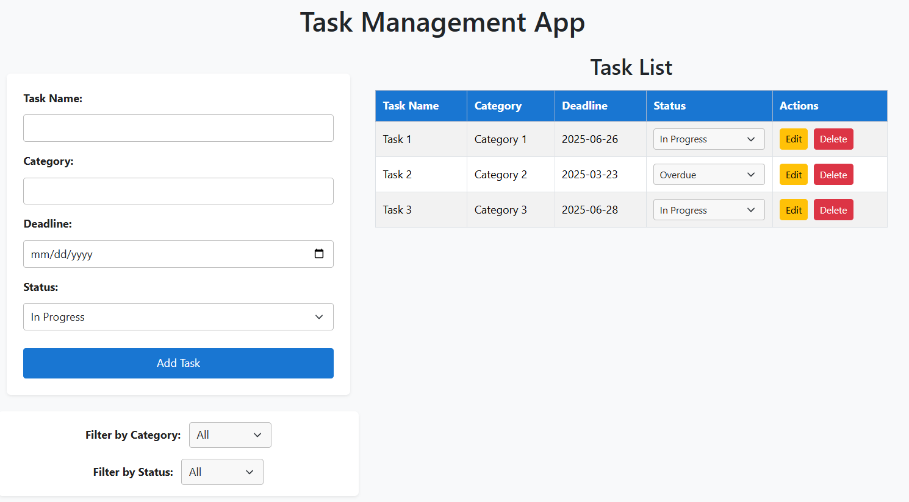
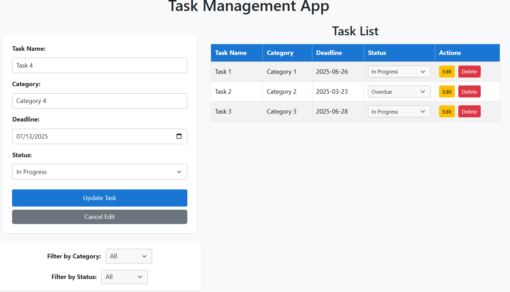
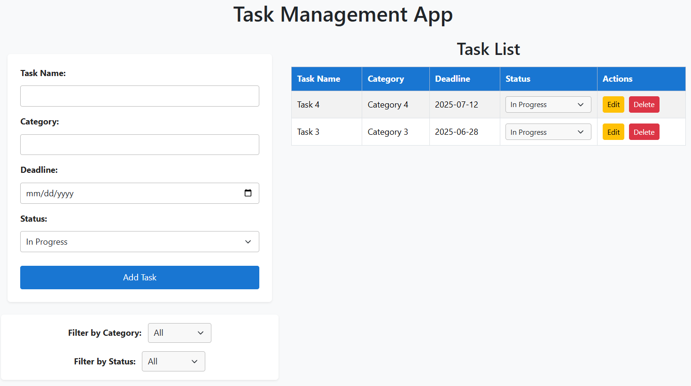
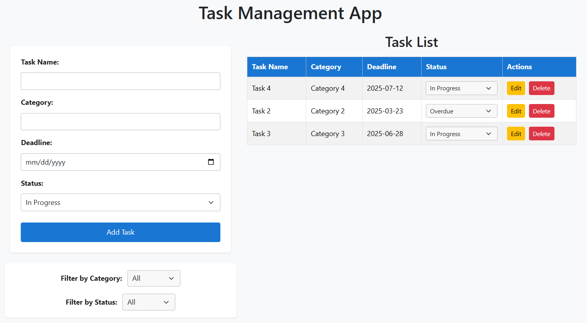

# SBA 4: Task Management App

## Overview

This is a simple Task Management App built with HTML, CSS, Bootstrap, and JavaScript. It allows users to add, view, filter, update, edit, and delete tasks. All tasks are saved in the browser's local storage, so your data persists even after refreshing the page.

## Screenshots
### Add Task to Task Mananagement App


### Update Task in Task Management App


### Updated Task List after Deletion of Task in Task Management App


### Updated Task List after Task Update in Task Management App


## Reflection
*Challenges faced during the project.*  
During the development of this Task Management App, I faced several challenges. One of the main difficulties was ensuring that the task data persisted correctly using local storage, especially when handling updates to task status and filtering. Managing the dynamic rendering of tasks and filters required careful synchronization between the UI and the underlying data. Another challenge was automatically updating the status of tasks to "Overdue" based on the deadline, which involved working with date formatting and comparison in JavaScript. Adding edit and delete functionality also required careful handling of form state and UI feedback.

*How you approached solving those challenges.*  
To address these challenges, I broke down the requirements into smaller, manageable functions and tested each feature incrementally. I used helper functions for date formatting and made sure to update the UI every time the data changed. I also paid attention to user experience by providing clear feedback and ensuring the filters updated dynamically. For editing and deleting, I managed form state with hidden fields and provided clear buttons for user actions.

*What you would improve if given more time.*  
If I had more time, I would improve the app by adding features such as notifications for upcoming deadlines, more advanced filtering and sorting, and perhaps user authentication for multi-user support. I would also enhance the UI for better accessibility and mobile responsiveness, and consider adding unit tests to ensure code reliability.

---

## Features

- **Add Tasks:** Enter a task name, category, deadline, and status.
- **Edit Tasks:** Update any task's details using the edit button.
- **Delete Tasks:** Remove tasks from the list with the delete button.
- **View Tasks:** All tasks are displayed in a table with their details.
- **Update Status:** Change the status of any task directly from the table.
- **Automatic Overdue:** Tasks with deadlines in the past are automatically marked as "Overdue" (unless Completed or Cancelled).
- **Filter Tasks:** Filter tasks by category or status using dropdowns.
- **Persistent Storage:** Tasks are saved in local storage and restored on page reload.
- **Bootstrap Styling:** Responsive and modern UI using Bootstrap 5.

---

## How to Use

1. **Add a Task**
   - Fill out the "Task Name", "Category", "Deadline", and select a "Status".
   - Click **Add Task** to add it to the list.

2. **Edit a Task**
   - Click the **Edit** button next to a task. The form will populate with the task's details.
   - Make your changes and click **Update Task** to save.
   - Click **Cancel Edit** to exit edit mode without saving changes.

3. **Delete a Task**
   - Click the **Delete** button next to a task to remove it from the list.

4. **View and Update Tasks**
   - All tasks appear in the "Task List" table.
   - Change a task's status using the dropdown in the "Status" column.

5. **Filter Tasks**
   - Use the "Filter by Category" and "Filter by Status" dropdowns to show only tasks that match your selection.
   - Select "All" to remove a filter.

6. **Automatic Overdue**
   - If a task's deadline passes and it is not marked as Completed or Cancelled, it will automatically be set to "Overdue" when the list is rendered.

7. **Persistent Storage**
   - All tasks are saved in your browser's local storage. They will remain after you refresh or close the page.

---

## File Structure

- `index.html` — Main HTML structure for the app, uses Bootstrap for layout and components.
- `styles.css` — Custom styles for layout and appearance.
- `app.js` — All JavaScript logic for adding, displaying, filtering, updating, editing, deleting, and saving tasks.
- `README.md` — This documentation.

---

## Technical Details

- **Task Object Structure:**
  ```js
  {
    name: "Task Name",
    category: "Category",
    deadline: "YYYY-MM-DD",
    status: "In Progress" | "Completed" | "Pending" | "Overdue" | "On Hold" | "Cancelled"
  }
  ```

- **Local Storage:**
  - All tasks are stored as a JSON array under the key `tasks`.

- **Filtering:**
  - Category filter is dynamically populated based on existing tasks.
  - Status filter includes all possible statuses.

- **Status Update:**
  - Changing the status in the table updates the task and saves it to local storage.

- **Edit/Delete:**
  - Edit and delete buttons are provided for each task row. Editing populates the form for update; deleting removes the task.

---

## Customization

- You can add more statuses by editing the `<select>` elements in `index.html` and updating the status options in `app.js`.
- You can further style the app by editing `styles.css` or using Bootstrap utility classes.

---

## Requirements

- Modern web browser (Chrome, Firefox, Edge, Safari, etc.)
- No backend or server required.

---

## Credits

Created for SBA 4: Task Management App.